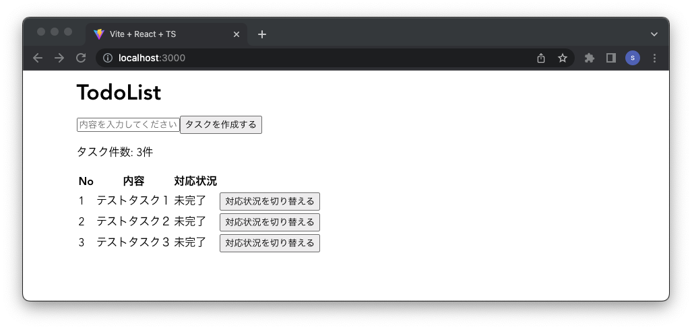

# TodoList

TodoList application using Solidity and React.js.



# Environment
- Node.js: v16.17.0
- npm: 8.15.0
- Solidity: 0.8.17

# Setup

- Install dependencies

```sh
$ npm install
```

- Compile Contract

```sh
$ npm run contract:compile
```

- Install client app's dependencies

```sh
$ cd clients

$ npm install
```

# Start for development
- Launch a local network.

```sh
$ npx hardhat node
```

- Deploy contracts to a local network.

```sh
$ npx hardhat run scripts/deploy.ts --network localhost
```

- Start client app.

```sh
$ cd clients

$ npm run dev
```

- Access to `http://localhost:3000`

# Testing
- Testing contract

```sh
$ npm run contract:test
```
